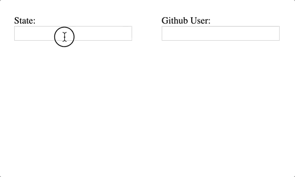

# Frame.io Frontend Take-home Exercise

Hi there, thank you for taking the time to do this coding exercise! We
understand that we may not be the only company asking this from you, so please
plan to spend no more than 4 hours on this.

The test is designed for all levels, and you could spend much longer perfecting
your solution if you wanted to. We recommend you focus on the core requirements
first, then work on any additional features if you have the time.

By 4 hours in, please feel free to stop working and document in `SOLUTION.md`
any refactors / code organization / enhancements you would have made with more
time.

If your submission meets our requirements, a Frame.io engineer will pair with
you during the on-site interview to continue working on it. You will be asked to
fix any potential bugs and build more features on top of it.

If you have any questions at any point during the exercise, please reach out to
Anna at anna@frame.io.

## Submission

Please `git commit` all of your changes in this repository. When you're done:

1. Rename this directory to your "first last" name.
2. Zip/compress this directory, excluding `node_modules`.
3. Submit your zip via the Greenhouse link you received. Please don't share the
   take-home publicly.
4. Email the recruiter to let them know you're done. Thank you!

## Overview

We’ve built a simple Autocomplete/Typeahead component in vanilla JavaScript
(compiled with Babel 7) that lets you type in a query and shows a list of
matching results in a dropdown, just like how Google's search box works.

To see this component in action, let's set up the repo:

1. Run `npm install`
2. Run `npm start` (runs `webpack-dev-server`)
3. Open `http://localhost:8080` on your browser.

Type "new" in the input, and you'll get a list of matching US states that start
with "new".

## Task

Currently, the component can only query against a static data array and only
works with mouse clicks. Your task is to:

1. Enhance the component so that it also accepts an HTTP endpoint as data
   source.

   For example, if you wire up the component to
   `https://api.github.com/search/users?q=${query}&per_page=${numOfResults}`,
   and if you type `foo` in the input, the component dropdown should show Github
   users that matches the query `foo`. When you select a user from the results,
   `item` in the `onSelect(item)` callback should be the selected Github user's
   id.

   (Each instance of the enhanced component only needs to work with either a
   data array or a HTTP source, not both.)

2. Implement keyboard shortcuts to navigate the results dropdown using up/down
   arrow keys and to select a result using the Enter key.

Uncomment the relevant sections in `index.js` and `index.html` to implement a
demo that looks like this:

## Requirements

- The component should be reusable. It should be possible to have multiple
  instances of the component on the same page.
- The "States" example that uses a data array should continue to work.
- The component should accept any HTTP endpoint, not just the
  `https://api.github.com/users` example above.
- Your component should work correctly in Chrome, don’t worry about
  cross-browser compatibility.
- You can use small DOM helpers like jQuery or utilities from Lodash, but not
  larger libraries/frameworks like React, Angular or Vue.js
- You _can_ modify all parts of the existing code, but you don't _need_ to do
  that to provide a great solution.
- Document your component in `SOLUTION.md`.
- Make sure that we can use `git log` to examine your changes.
